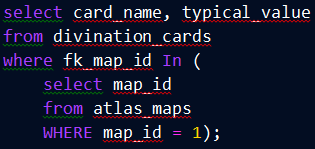
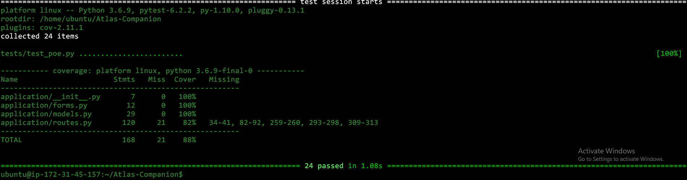

 
 
https://trello.com/b/nbbi3EbD/path-of-exile-atlas-app
 
 
Atlas Companion was a passion project created that uses python3-flask, jinja2's templating and mysql databases. Its goal was to deliver current updated information about the world map of the video game; path of exile, commonly referred to as the atlas of worlds or atlas for short.
 
 

<h1>The initial goals of the app were the following:</h1>

• Create an image-mapped multi hyperlinked home page that linked to each corresponding page. 
 
• Create a dedicated information webpage for each of the 8 regions of the atlas plus one extra for the uncharted realms.
 
• Add a region skill tree image to each region page that opens a new webpage when prompted for a bigger clearer view of the information
 
• Display the relevant information on each region webpage including but not limited to maps, atlas base types and divination cards    
 
• The ability to create, display, update and delete (CRUD) map entries using the created relational mysql database
 
• The ability to CRUD divination card entry’s to the relevant assigned maps
 
• The ability to CRUD filtered tables of each divination card and what maps it is assigned to
 
• A search bar located on the home page to quickly navigate to the information you are looking for

 
<h3>My database would consist of five tables seen below in my ERD diagram:</h3>
 
 

 
 
As seen above we have a separate table to allocate our many to many to relationships between divination cards and maps.
To query all the divination cards in a single map we use the following:
 

 
And for the reverse for what maps contain a single divination card:
 

 
 
<h3>My SQL database defined as db. Models and built using create.py:</h3>

 

 
 

__**<h1>Risk Assessment</h1>**__

 

 

 

__**<h1>Challenges faced and project evolution</h1>**__

 
My first challenge was creating my tables and implementing my relationships so I can query all the data I wanted. I initially had four tables but I soon realised the limitations of SQL, I had to create another table Cmap, so I could map as many divination cards to as many maps as I wanted using the corresponding foreign keys and as many to many relationships.
 
 
My Second challenge, and definitely my biggest, was trying to implement my pre-existing mysql database into my application, I tried on and off but mostly on for around three days to get it to work but it just refused to.
 
 
So I learned a very valuable lesson that it is almost always better to build your SQL tables using the flask db.models classes, in hindsight I would have saved a lot of time troubleshooting. which I would have used to add features to my application.
 
 
As a result of my issues during the development, I was unable to add all the features I planned to due to time restrictions, managing to only add the CRUD functionally of maps.
Moving forward I will take more consideration when designing, creating, and integrating databases into my application and will always make sure to create them using flask where ever possible. 
 
 
                                                                        
                                                                      
__**<h1>Completed Application showcase:</h1>**__
   
 

<h3>Interactive hyperlinked global region map</h3>
  

 
 

<h3>The Html code behide the image mapping and home page</h3>

 

 

<h3>My New Vastir Region page with implemented create form and filtered map display table</h3>
 
   
  
  

 

<h3>Expanded skill tree image that opens in a new tab</h3>
  
   
  
  

  
  
   
  
  
  __**<h1>Video Demonstration of my application and all its features</h1>**__
  
 
   
  
  
  
  
   
  
  
  <h1>Application Test Coverage Report using Flask Pytest</h1> 

  
   
  
  
  
  
  
   
  
  <h1>Application being deployed with jenkins via gunicorn</h1>
 
  
 
 

 
 

__**<h1>Conclusion</h1>**__
 
 
  
 

In conclusion, I think for the current knowledge I processed during my first project and what I possess now is night and day, If I were to face the same challenges that stunted my development I feel that would be able to overcome them in a fraction of the time.

 

It has been an excellent learning experience in project management, python/html programming and database management, I very much look forward in the future for continued development of flask based applications and continued support/redesign of this project as it was a passion project.

